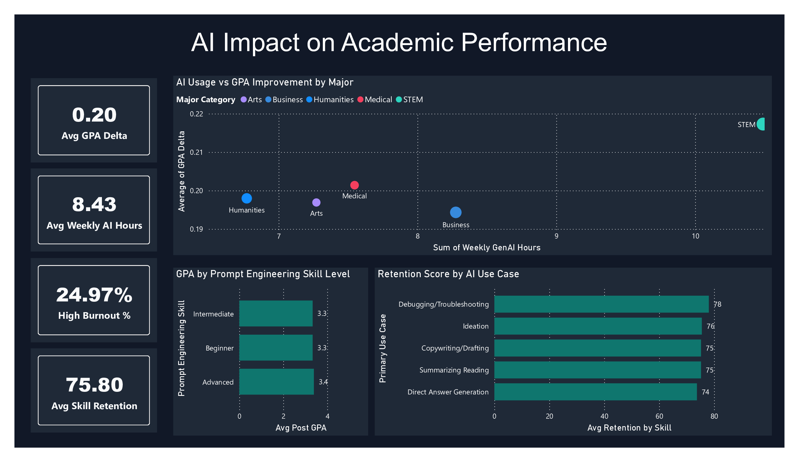

# 🎓 AI Impact on Student Academic Performance
### Power BI Dashboard | Data Analytics Portfolio Project

---

## 📌 Project Overview

An interactive 5-page Power BI dashboard analyzing the impact of AI tools on student academic performance across **50,000 student records**. The project explores how AI usage, institutional policies, and burnout risk affect GPA, skill retention, and exam anxiety.

**Key question:** *Does using AI tools actually improve student outcomes — and what factors matter most?*

---

## 📊 Dashboard Pages

### Page 1 — AI Impact on Academic Performance
- Scatter plot: AI usage hours vs GPA improvement by major category
- Bar chart: GPA by Prompt Engineering skill level (Beginner → Advanced)
- Bar chart: Skill Retention Score by AI use case



### Page 2 — Student Profile & Demographics
- Donut chart: student distribution by major (STEM, Business, Humanities, Medical, Arts)
- Bar chart: student count by year of study (Freshman → Graduate)
- Bar chart: GPA improvement — Paid vs Free AI subscriptions

### Page 3 — Institutional Policy Analysis
- Bar chart: average GPA by institutional AI policy
- Bar chart: skill retention score by institutional AI policy
- Stacked bar chart: burnout risk distribution across majors

### Page 4 — Burnout & Anxiety Insights
- Scatter plot: traditional study hours vs GPA growth by burnout level
- Donut chart: burnout risk level distribution (High / Medium / Low)
- Bar chart: exam anxiety score by major category

### Page 5 — Filters
- Interactive slicers: Year of Study, Major Category, Burnout Risk Level, Institutional Policy

---

## 💡 Key Insights

| Insight | Finding |
|---|---|
| 📈 AI boosts GPA | Students using AI tools show average GPA delta of **+0.20** |
| 🎯 Skill matters more than hours | Advanced prompt engineering users reach GPA **3.4** vs 3.3 for beginners |
| 🏫 Policy impact | Universities that actively encourage AI show GPA **3.4** vs **3.3** under strict ban |
| 💳 Paid tools edge | Paid subscription users: **0.207** GPA delta vs **0.200** for free users |
| 🔥 Burnout paradox | High burnout students show lower traditional study hours but higher GPA delta |
| 😰 STEM most anxious | STEM students report highest exam anxiety score: **4.4 / 5** |
| 🏆 Best AI use case | Debugging/Troubleshooting yields highest retention score: **78 / 100** |

---

## 🛠 Technical Stack

**Visualizations:** Card, Scatter Plot, Bar Chart, Donut Chart, Stacked Bar Chart, Slicer

---

### DAX Measures

**GPA & Academic Performance**
```dax
Avg GPA Delta = 
AVERAGE('ai_student_impact_dataset (1)'[Post Semester GPA]) - AVERAGE('ai_student_impact_dataset (1)'[Pre Semester GPA])

Avg GPA Delta by Group = 
AVERAGE('ai_student_impact_dataset (1)'[Post Semester GPA]) - AVERAGE('ai_student_impact_dataset (1)'[Pre Semester GPA])

Avg Post GPA = 
AVERAGE('ai_student_impact_dataset (1)'[Post Semester GPA])

Avg GPA by Policy = 
AVERAGE('ai_student_impact_dataset (1)'[Post Semester GPA])

Avg GPA Paid = 
CALCULATE(
    AVERAGE('ai_student_impact_dataset (1)'[Post Semester GPA]),
    'ai_student_impact_dataset (1)'[Paid Subscription] = TRUE()
)

Avg GPA Free = 
CALCULATE(
    AVERAGE('ai_student_impact_dataset (1)'[Post Semester GPA]),
    'ai_student_impact_dataset (1)'[Paid Subscription] = FALSE()
)
```

**Skill Retention & Study Hours**
```dax
Avg Skill Retention = 
AVERAGE('ai_student_impact_dataset (1)'[Skill Retention Score])

Avg Retention by Policy = 
AVERAGE('ai_student_impact_dataset (1)'[Skill Retention Score])

Avg Retention by Skill = 
AVERAGE('ai_student_impact_dataset (1)'[Skill Retention Score])

Avg Trad Hours by Burnout = 
AVERAGE('ai_student_impact_dataset (1)'[Traditional Study Hours])

Avg Weekly AI Hours = 
AVERAGE('ai_student_impact_dataset (1)'[Weekly GenAI Hours])
```

**Anxiety**
```dax
Avg Anxiety = 
AVERAGE('ai_student_impact_dataset (1)'[Anxiety Level During Exams])
```

**Burnout**
```dax
High Burnout % = 
DIVIDE(
    COUNTROWS(FILTER('ai_student_impact_dataset (1)', 'ai_student_impact_dataset (1)'[Burnout Risk Level] = "High")),
    COUNTROWS('ai_student_impact_dataset (1)')
)

Burnout High Count = 
CALCULATE(
    COUNTROWS('ai_student_impact_dataset (1)'),
    'ai_student_impact_dataset (1)'[Burnout Risk Level] = "High"
)

Burnout High % by Policy = 
DIVIDE(
    CALCULATE(
        COUNTROWS('ai_student_impact_dataset (1)'),
        'ai_student_impact_dataset (1)'[Burnout Risk Level] = "High"
    ),
    COUNTROWS('ai_student_impact_dataset (1)')
) * 100

Burnout Medium % = 
DIVIDE(
    COUNTROWS(FILTER('ai_student_impact_dataset (1)', 'ai_student_impact_dataset (1)'[Burnout Risk Level] = "Medium")),
    COUNTROWS('ai_student_impact_dataset (1)')
) * 100

Burnout Low % = 
DIVIDE(
    COUNTROWS(FILTER('ai_student_impact_dataset (1)', 'ai_student_impact_dataset (1)'[Burnout Risk Level] = "Low")),
    COUNTROWS('ai_student_impact_dataset (1)')
) * 100
```

**Subscription**
```dax
Paid Subscription % = 
DIVIDE(
    COUNTROWS(FILTER('ai_student_impact_dataset (1)', 'ai_student_impact_dataset (1)'[Paid Subscription] = TRUE())),
    COUNTROWS('ai_student_impact_dataset (1)')
) * 100
```

**General**
```dax
Total Students = 
COUNTROWS('ai_student_impact_dataset (1)')
```

---

### DAX Calculated Column
```dax
GPA Delta = 
'ai_student_impact_dataset (1)'[Post Semester GPA] - 'ai_student_impact_dataset (1)'[Pre Semester GPA]

Subscription_Type = 
IF('ai_student_impact_dataset (1)'[Paid Subscription] = TRUE(), "Paid", "Free")
```

---

### Power Query — Custom Columns for Manual Sort Order

Two helper columns were added in Power Query to control the sort order of categorical axes in charts.

**`Year_Order`** — used to sort `Year of Study` in the correct academic progression (Freshman → Graduate) instead of alphabetical order:
```
if [Year_of_Study] = "Freshman" then 1
else if [Year_of_Study] = "Sophomore" then 2
else if [Year_of_Study] = "Junior" then 3
else if [Year_of_Study] = "Senior" then 4
else if [Year_of_Study] = "Graduate" then 5
else 0
```

**`Burnout_Order`** — used to sort `Burnout Risk Level` from lowest to highest risk (Low → Medium → High) in stacked bar and donut charts:
```
if [Burnout_Risk_Level] = "Low" then 1
else if [Burnout_Risk_Level] = "Medium" then 2
else if [Burnout_Risk_Level] = "High" then 3
else 0
```

After creating these columns in Power Query, each text column was linked to its order column via **Column Tools → Sort by Column** in Power BI Desktop.

**Additional Power Query transformations:**
- Replaced `_` with spaces in categorical columns (`Institutional_Policy`, `Primary_Use_Case`, etc.) for cleaner chart labels

---

## 📁 Dataset

| Column | Type | Description |
|---|---|---|
| `Student_ID` | Integer | Unique student identifier |
| `Major_Category` | Text | Academic major (STEM, Business, etc.) |
| `Year_of_Study` | Text | Academic year (Freshman → Graduate) |
| `Pre_Semester_GPA` | Decimal | GPA before AI tool adoption |
| `Post_Semester_GPA` | Decimal | GPA after AI tool adoption |
| `Weekly_GenAI_Hours` | Decimal | Weekly hours spent using AI tools |
| `Primary_Use_Case` | Text | Main AI use case |
| `Prompt_Engineering_Skill` | Text | Skill level (Beginner / Intermediate / Advanced) |
| `Institutional_Policy` | Text | University AI policy |
| `Burnout_Risk_Level` | Text | Burnout risk (Low / Medium / High) |
| `Skill_Retention_Score` | Integer | Knowledge retention score (0–100) |
| `Paid_Subscription` | Boolean | Paid vs free AI tool |
| `Anxiety_Level_During_Exams` | Decimal | Exam anxiety score (1–5) |

**Source:** [AI Student Impact Dataset — Kaggle](https://www.kaggle.com/datasets/laveshjadon/ai-impact-on-students/data)

---

## 🎨 Design

- **Color palette:** Dark theme (`#111827` background, `#1F2937` cards)
- **Accent:** Teal (`#2DD4BF`, `#0F766E`, `#0D4F47`)
- **Fonts:** Segoe UI (Power BI default), Arial

---

## 🚀 How to Open

1. Download the `.pbix` file from this repository
2. Open with [Power BI Desktop](https://powerbi.microsoft.com/desktop/) (free)
3. The dataset is embedded — no additional setup required
4. Use **Page 5 (Filters)** to slice data across all pages

---

## 👤 Author

**Stanislav Kutia**
- 📧 kutia.work@gmail.com
- 💼 Aspiring Data Analyst | Power BI | SQL | Excel

---

*This project was built as part of a data analytics portfolio. Dataset contains synthetic student data.*
